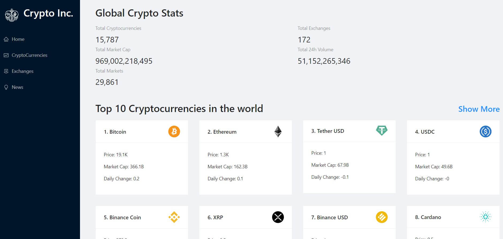

# Crypto Incorporated

This is a Crypto Application with real time data and news using RapidAPI and Reactjs for builing user interface.

## Table of contents

- [Screenshot](#screenshot)
- [Links](#links)
- [Built with](#built-with)
- [Author](#author)
- [Acknowledgments](#acknowledgments)

### Screenshot



### Links

- Solution URL: [https://github.com/ErysCode7/crypto-incorporated](https://github.com/ErysCode7/crypto-incorporated)
- Live Site URL: [https://crypto-incorporated-web.vercel.app/](https://crypto-incorporated-web.vercel.app/)

1. Clone the repo

   ```sh
   git clone git@github.com:ErysCode7/crypto-incorporated.git
   ```

2. Install NPM packages

   ```sh
   npm install
   ```

3. Run app

   ```sh
   npm start
   ```

### Built with

- [React](https://reactjs.org/) - JS library
- [AntDesign](https://ant.design/) - React UI component
- [Redux Toolkit Query](https://redux-toolkit.js.org/rtk-query/overview) - RTK Query is a powerful data fetching and caching tool. It is designed to simplify common cases for loading data in a web application,
- Chart.js
- Mobile-first workflow
- React Router DOM
- RapidAPI

## Author

- Facebook - [Erys Mozo](https://web.facebook.com/erys.mozo/)
- Instagram - [\_erysmozo](https://www.instagram.com/_erysmozo/)
- Frontend Mentor - [ErysCode7](https://www.frontendmentor.io/profile/ErysCode7)
- LinkedIn - [Erys Mozo](https://www.linkedin.com/in/erys-mozo-280190230/)

## Acknowledgments

I acknowledge myself that I can build these amazing things. Hoping to improve and learn better.
